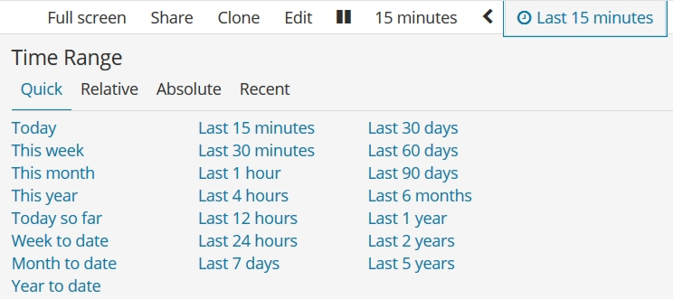
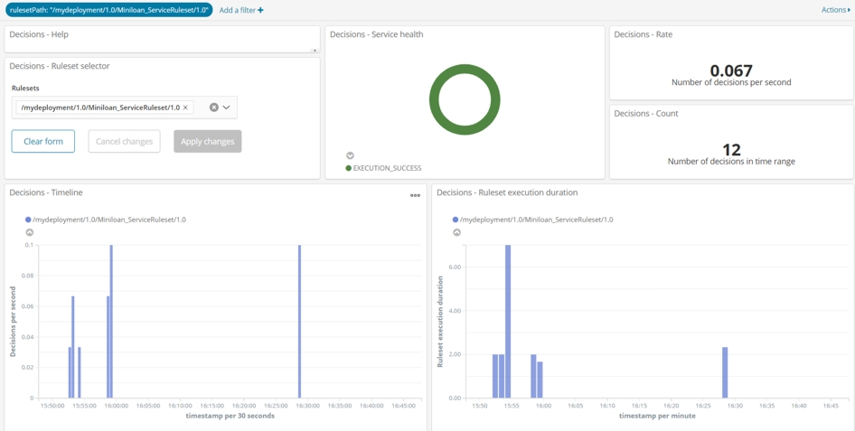
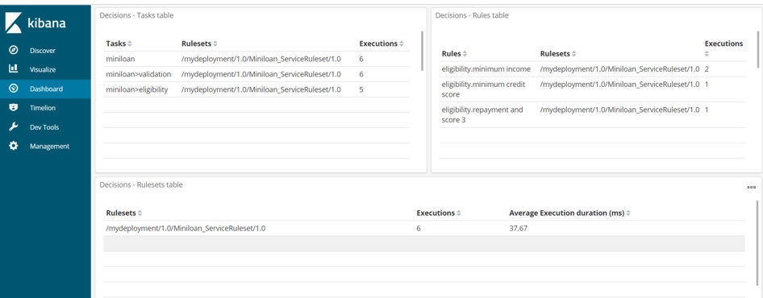
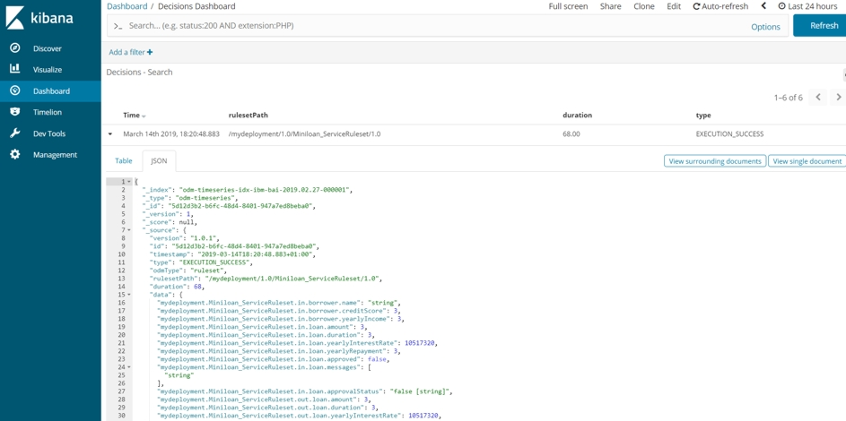
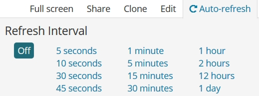

# Task 4: Looking at the predefined dashboard

You look at events displayed in the Decisions dashboard.

In this tutorial, you use two Kibana dashboards to visualize events that are generated by running the Miniloan Service ruleset in the Rule Execution Server console. In this task, you use the Decisions dashboard (see [Decisions dashboard](https://www.ibm.com/support/knowledgecenter/SSYHZ8_18.0.x/com.ibm.dba.bai/topics/con_bai_odm_dashboards.html)), and in task 5, you make a custom dashboard (see [Kibana](https://www.elastic.co/products/kibana)).

You do the following work in this task:
-   Locate and open the predefined dashboard.
-   Filter the dashboard to monitor events from the Miniloan Service ruleset.
-   Emit events from Rule Execution Server.
-   Look at the information for the emitted events in the dashboard.

## Step 1: Discovering the predefined dashboard

You look at a Kibana Decisions dashboard, which monitors decisions and comes with Business Automation Insights.

1.   In your web browser, open your Kibana instance by using its URL. 
2.   In the main Kibana menu on the left side of the page, click **Dashboard** to find the predefined dashboard:

3.   In the dashboard list, click **Decisions Dashboard**. You can also enter "Decision" in the search field to find the predefined dashboard.

The predefined dashboard displays only technical data. It does not show input or output data. 

By default, the time range of the dashboard is set to the last 15 minutes, so only events in the last 15 minutes are shown in the dashboard. To see older events, you can change the time range by clicking **Last 15 minutes** at the top of the dashboard:

In the Decisions - Service health box at the top of the dashboard, you see that the service is healthy. The decisions are applied without failure. You can see the number of decisions and their distribution in the time range.

**Note:** If other users are also sending events to the Business Automation Insights installation, it might show their events as well as yours.

4.   In the ruleset selector, click **Select**.
5.   Select *mydeployment/1.0/Miniloan_ServiceRuleset/1.0*, and click **Apply changes**. 

Now the dashboard displays only the decisions sent from the Miniloan Service ruleset:

You can see the ruleset filter in the top banner of the dashboard. To remove the filter, hover over it and click the **Remove filter** button. This is a standard Kibana feature. 

6.   In the dashboard, scroll down to see the executed tasks and rules:

7.   Scroll to the bottom to get the decision search.
8.   Open one event and select the JSON tab to see the contents of all the events:

## Step 2: Monitoring decision events

Monitor events from the Miniloan Service ruleset.

1.   Scroll to the top of the dashboard.
2.   Click **Auto-Refresh** and set the refresh interval to five seconds:

3.   Go back to the REST service in the Rule Execution Server console and send events as you did in the previous task. You want to see events in the console as well as the dashboard. Use the following sets of values:

Set 1:

    { "loan": { "amount": 35000, "duration": 240, "yearlyInterestRate": 0.05 },
    "borrower": { "name": "Joe Doe", "creditScore": 150, "yearlyIncome": 8000 } }

Set 2:

    { "loan": { "amount": 50000, "duration": 240, "yearlyInterestRate": 0.05 },
    "borrower": { "name": "Joe Doe", "creditScore": 500, "yearlyIncome": 80000 } }

Set 3:

    { "loan": { "amount": 40000, "duration": 240, "yearlyInterestRate": 0.05 },
    "borrower": { "name": "Joe Doe", "creditScore": 150, "yearlyIncome": 8000 } }

Set 4:

    { "loan": { "amount": 20000, "duration": 240, "yearlyInterestRate": 0.05 },
    "borrower": { "name": "Joe Doe", "creditScore": 500, "yearlyIncome": 80000 } }

4.   Return to the Kibana dashboard to see the entries for the new events.
5.   When you are done, click **5 seconds** at the top of the dashboard and select **Off** to stop the automatic refreshing.

**Next**

In the next task, you make a custom Kibana dashboard. 

[**Next task**](../gs_topics/tut_bai_gs_custom_lsn.md)

[**Main page**](../README.md)

