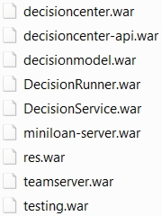

# Task 1: Enabling the Business Automation Insights plug-in

You configure the sample server to use the Business Automation Insights plug-in.

_____________________________________________________________________________________

**Note:** This task explains how to enable the ODM emitter for ruleset runs. It can be followed with the on-premises version of Operational Decision Manager. For installation and parameters on other types of services:

-    Operational Decision Manager on IBM Cloud Private, see [Configuring the ODM event emitter](https://www.ibm.com/support/knowledgecenter/en/SSQP76_8.10.x/com.ibm.odm.icp/topics/tsk_custom_emitters.html)
-    Operational Decision Manager on IBM Digital Business Automation for Multicloud, see [Installing automation containers from the user interface](https://www.ibm.com/support/knowledgecenter/en/SSYHZ8_18.0.x/com.ibm.dba.install/topics/tsk_install_ui.html) 

_____________________________________________________________________________________

You do the following work in this task:
-   Create a sample server profile.
-   Define the Business Automation Insights configuration properties.
-   Configure the DecisionService web application.
-   Start the sample server.

**Important:** In this tutorial, you use the default configuration for the Business Automation Insights plug-in. The plug-in can try to connect to Kafka numerous times. This can reduce performance, and should be taken into consideration when moving to production (see [Moving to production](https://www.ibm.com/support/knowledgecenter/SSYHZ8_18.0.x/com.ibm.dba.bai/topics/tsk_bai_moving_to_prod.html)).

## Step 1: Creating the sample server profile
You create a profile for the sample server. To get more information about the following commands, see [Starting and stopping the sample server](https://www.ibm.com/support/knowledgecenter/SSQP76_8.10.x/com.ibm.odm.distrib.samples/smp_console_topics/tpc_smpserver_starting.html).

1.   The first time you run the sample server, a profile is created for the web applications that are used by Operational Decision Manager. If you have run the sample server, you must delete the profile file. Otherwise, skip to the next substep to start the sample server.

To delete the profile:

a.   Stop the sample server if it is running.

b.   Delete the Operational Decision Manager profile, for example, LibertyInstall/usr/servers/odm81010.

2.   Start the sample server, and wait for the following message before continuing:

    [samples.echo] GBRPS0029I: start.server is completed.
    BUILD SUCCESSFUL

3.   Look in *LibertyInstall*/usr/servers/, and open the new profile directory. 
4.   Open the apps directory in the profile. It contains the web applications that are used by Operational Decision Manager:

You reconfigure DecisionService.war in step 3. 

5.   Stop the sample server.

## Step 2: Defining the Business Automation Insights properties

You define the connection to your Business Automation Insights instance. The settings are defined in the property file *config.properties*, which you must complete with the values that correspond to your Business Automation Insights installation (see [Configuring the ODM event emitter](https://www.ibm.com/support/knowledgecenter/SSQP76_8.10.x/com.ibm.odm.distrib.config/topics/con_config_bai.html)). 

1.   Open *GettingStartedInstall*/data/config.properties.

**Note:** If security is enabled on your Business Automation Insights installation, you must edit the property file in *GettingStartedInstall*/data/configWithSecurity.properties. You set the property values shown in substep 2 and for the security settings (see [Securing ODM emitter communications to Kafka](https://www.ibm.com/support/knowledgecenter/SSYHZ8_18.0.x/com.ibm.dba.bai/topics/tsk_bai_security_comm_top_odm_emitter_to_kafka.html)). In Windows, give the full path to a key file by using the slash or doubling the backslash to avoid the skipping mechanism.

2.   Enter the following values:

-   *com.ibm.rules.bai.plugin.topic*: Enter the name of the Kafka topic with the ingress role as defined during the prerequisite BAI installation.
-   *com.ibm.rules.bai.plugin.kafka.bootstrap.servers*: Enter the Kafka bootstrap servers of the Kafka server configured during the prerequisite BAI install.

3.   Save your changes.

## Step 3: Enabling the Business Automation Insights plug-in in the Rule Execution Server configuration

You use the **res-setup** command (see [Enabling the emitter with Ant](https://www.ibm.com/support/knowledgecenter/SSQP76_8.10.x/com.ibm.odm.distrib.config/topics/tsk_emitters_ressetup.html)) to repackage the DecisionService web application to enable the Business Automation Insights ODM emitter plug-in by using the property file you completed in step 2.

1.   Test that you can use the Ant command. In a terminal, call the command **ant -version**. The response should be "Apache Ant version 1.7.1 compiled on June 27 2008." If you do not get this message, set up your environment to use the Ant command (see [Setting up your environment to automate processes](https://www.ibm.com/support/knowledgecenter/SSQP76_8.10.x/com.ibm.odm.distrib.install/topics/tsk_setting_up_ant.html)). 

2.   Use the following command in a terminal with the appropriate values for the paths to Liberty and the GettingStartedInstall directory:

    cd <ODMInstall>/executionserver/bin
    ant -f ressetup.xml -Dbai.war.in=../applicationservers/WLP/DecisionService.war -Dbai.war.out=<LibertyInstall>/usr/servers/<profileName>/apps/DecisionService.war
    -Dbai.enable=true -Dbai.properties=<GettingStartedInstall>/data/config.properties setup-bai

**Note:** If security is enabled on your Business Automation Insights installation, use the property file *GettingStartedInstall*/data/configWithSecurity.properties.

The command repackages the DecisionService application in the app server directory. Now your Rule Execution Server can emit events to Business Automation Insights.

When the command finishes, it shows the following output:

    setup-bai:
    [echo] WAR : ../applicationservers/WLP/DecisionService.war

    BUILD SUCCESSFUL

3.  (Optional) Check the Liberty apps directory for changes to the DecisionService.war.

**Next**

In the next task, you configure a ruleset to emit events to Business Automation Insights.

[**Next task**](../gs_topics/tut_bai_gs_prop_ruleset_lsn.md)

[**Main page**](../README.md)

