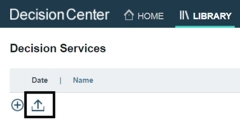
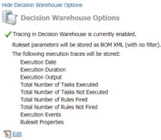
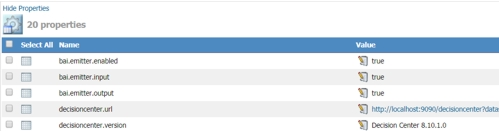

# Task 2: Enabling Business Automation Insights properties for a ruleset

You use the Decision Center Business console to deploy a ruleset in a RuleApp from the Miniloan Service decision service to Rule Execution Server (see [Getting started with decision services](https://www.ibm.com/support/knowledgecenter/SSQP76_8.10.x/com.ibm.odm.distrib.samples/smp_console_topics/tpc_smpserver_starting.html)). Then, you use the Rule Execution Server console to set properties that enable events to be emitted from the ruleset to Business Automation Insights. 

You do the following work in this task:
-   Deploy the Miniloan Service to Rule Execution Server.
-   For the Miniloan Service ruleset, disable the Decision Warehouse tracing properties, which do not work with Business Automation Insights.
-   For the Miniloan Service ruleset, enable the Business Automation Insights properties so that ruleset execution emits events to Business Automation Insights.

**Note:** The properties can also be set in the Business console (see [
Deployment configurations](https://www.ibm.com/support/knowledgecenter/SSQP76_8.10.x/com.ibm.odm.dcenter.bu.bconsole/deploy/con_cmg_deployconf_editor.html)).

## Step 1: Deploying Miniloan Service

You deploy a RuleApp from the Miniloan Service decision service to Rule Execution Server.

1.   Start the sample server (see [Starting and stopping the sample server](https://www.ibm.com/support/knowledgecenter/SSQP76_8.10.x/com.ibm.odm.distrib.samples/smp_console_topics/tpc_smpserver_starting.html)).
2.   Log in to the Business console by using the URL [http://localhost:9090/decisioncenter](http://localhost:9090/decisioncenter), and *odmAdmin* as the user name and password (see [
Opening Decision Center on the sample server](https://www.ibm.com/support/knowledgecenter/en/SSQP76_8.10.x/com.ibm.odm.dcenter.samples/shared_dcsample_topics/tpc_starting_rts_sample_server.html)). 
3.   In the Library tab, open the main branch of the Miniloan Service decision service.

_____________________________________________________________________________________

**Note:** If you are not working with an on-premises instance of Operational Decision Manager, you might have to import the decision service into the Business console:

   a.   In the Library tab, click the **Import Decision Service** button:
     
   
     

   b.   In the Import Decision Service window, click **Choose** and navigate to *GettingStartedInstall/miniloan.zip*.

   c.   Click **Import** to import the decision service.

_____________________________________________________________________________________

4.   Open the Deployments tab.
5.   Click the Miniloan deployment configuration.
6.   Click **Deploy** in the upper right corner of the window. A dialog box opens with a summary of the deployment configuration. 
7.   Click the option to deploy to the sample server.
8.   Click **Deploy**. A message opens with the status of the deployment, and the Reports subtab opens in the Deployments tab.

## Step 2: Disabling Decision Warehouse tracing

The ruleset in the deployed RuleApp has Decision Warehouse tracing enabled because the ruleset is also used in another tutorial. You must disable the tracing because it is not compatible with Business Automation Insights (see [
Integrating with IBM Business Automation Insights](https://www.ibm.com/support/knowledgecenter/SSQP76_8.10.x/com.ibm.odm.distrib.overview/topics/con_bai.html)).

1.   Log in to Rule Execution Server by using the URL [http://localhost:9090/res](http://localhost:9090/res), and *odmAdmin* as the user name and password. 
2.   In the Explorer tab, open mydeployment/Miniloan_ServiceRuleset.  
3.   Click **Show Decision Warehouse options** to open the the options:

4.   Click **Edit** and deselect **Enable tracing in Decision Warehouse**.
5.   Click **Save**. You see that the tracing is disabled.

## Step 3: Adding the Business Automation Insights emitters

You add properties to the ruleset to enable the emission of events to Business Automation Insights, and the values to include in the events (see [Built-in ruleset properties for the ODM event emitter](https://www.ibm.com/support/knowledgecenter/SSQP76_8.10.x/com.ibm.odm.dserver.rules.res.console/topics/con_rescons_rs_prop_bai.html)). 

1.   Click **Add property**. 
2.   Select the predefined property **bai.emitter.enabled**. 
3.   Change the value of the property to **true** and click **Add**. 
4.   Do the same for the predefined properties **bai.emitter.input** and **bai.emitter.output** to get the input and output values.

**Next**

In the next task, you run the Miniloan Service ruleset in the Rule Execution Server console. 

[**Next task**](../gs_topics/tut_bai_gs_emit_lsn.md)

[**Main page**](../README.md)

